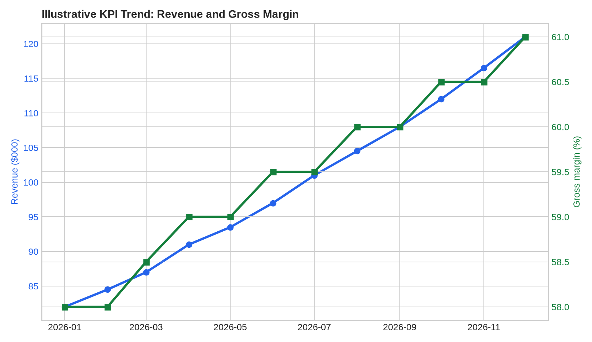
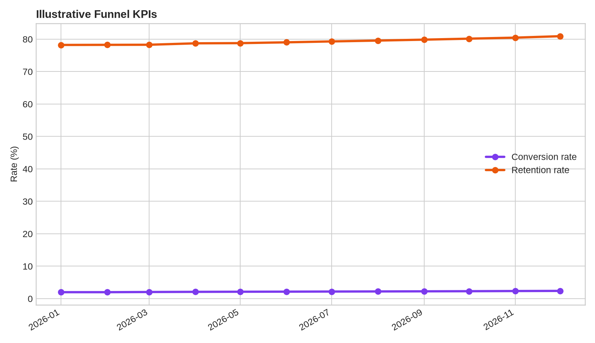

# Business KPI Calculator

> Reusable KPI engine for revenue, growth, margins, conversion, retention, productivity, and unit economics.

## Business Problem

Teams frequently calculate similar metrics inconsistently. This project standardizes KPI definitions, inputs, edge cases, and interpretation so reported metrics are comparable and auditable.

## Analytical Questions

- What is the exact KPI definition?
- Which inputs and denominators are required?
- How should zero, null, or missing periods be handled?
- Which KPI movements require investigation?

## Deliverables

- KPI calculation library
- Metric-definition catalogue
- Input validation
- Example business dataset
- KPI trend report
- Interpretation guide

## Suggested Repository Structure

```text
business-kpi-calculator/
├── data/
├── notebooks/
├── src/
├── tests/
├── outputs/
├── README.md
└── requirements.txt
```

## Stack

Python, pandas, SQL, Plotly, pytest

## Method

1. Define the decision context and metric definitions.
2. Profile and validate the data.
3. Build reproducible transformations and calculations.
4. Quantify the main drivers, scenarios, or failure modes.
5. Validate outputs and document limitations.
6. Produce an executive-ready decision narrative.

## Portfolio Standard

Use synthetic or public data with documented provenance. Clearly distinguish measured results from assumptions and illustrative scenarios.

## Sample Outputs

Run `python src/generate_outputs.py` to reproduce the twelve-month illustrative KPI trend report. The data is synthetic and exists to demonstrate consistent metric definitions.

### Executive summary

See [`outputs/executive_summary.md`](outputs/executive_summary.md) for the latest KPI readout and limitations.





- [`outputs/kpi_trend_report.csv`](outputs/kpi_trend_report.csv) — monthly KPI series
- [`outputs/kpi_summary.csv`](outputs/kpi_summary.csv) — latest-period summary
